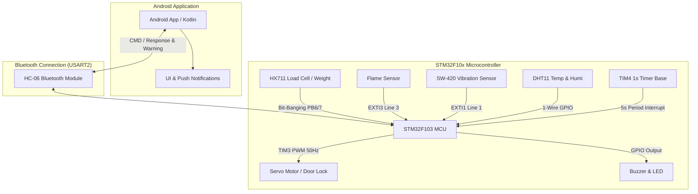

# 🔒 스마트 보안 사물함 (Smart Security Locker)

> **2025학년도 임베디드 설계 및 실험 텀프로젝트**  
> **STM32F10x 마이크로컨트롤러**와 **Android 어플리케이션** 간의 블루투스 통신 기반 스마트 보안 사물함 시스템입니다.

---

## 📱 APK 다운로드 & 앱 미리보기

<p align="center">
  <a href="https://drive.google.com/file/d/1du3aevooQzEX0ROPMGJoW2Bn3_NWNzR6/view?usp=sharing">
    
  </a>
</p>

> ⚠️ **주의**: 어플리케이션 실행 시 블루투스 및 알림 등 모든 권한을 허용해 주세요.

<p align="center">
  
</p>

---

## 🏗️ 시스템 아키텍처 (Architecture)

본 시스템은 STM32 마이크로컨트롤러가 센서와 모터를 제어하며, 블루투스(USART2)를 통해 안드로이드 앱과 실시간 양방향 데이터 통신을 수행합니다.



---

## 🛠️ 기술 스택 (Tech Stack)

### Firmware (Hardware & Embedded)
* **MCU**: STM32F103 (ARM Cortex-M3 @ 72MHz)
* **IDE / Toolchain**: IAR Embedded Workbench for ARM (EWARM)
* **Library**: STM32F10x Standard Peripheral Library (v3.5)
* **Timers**: `TIM3` (PWM 50Hz 모터 제어), `TIM4` (1초 주기 타임베이스)
* **Interrupts**: `EXTI1` (진동 감지), `EXTI3` (화재 감지), `USART2` (수신 인터럽트)

### Mobile Application
* **Platform**: Android (Kotlin)
* **IDE**: Android Studio
* **Communication**: Bluetooth SPP (Serial Port Profile)
* **Features**: Live Logging, Emergency Popups, System Push Notifications

---

## ✨ 주요 기능 (Features)

| 기능 | 설명 | 앱 화면 |
| :---: | :--- | :---: |
| **블루투스 연결/해제** | 주변 사물함 블루투스 장치를 검색하여 연결 및 해제합니다. |  |
| **원격 잠금 & 잠금해제** | 앱에서 서보모터를 제어하여 사물함 잠금/해제 상태를 토글합니다. |  |
| **압력 센서 영점 조절** | 로드셀 센서의 영점(Tare)을 실시간으로 보정합니다. |  |
| **도난 감지 기준 설정** | 잠금 시 무게 변화량이 임계값을 넘으면 도난을 판단합니다. |  |
| **로그 기록 및 공유** | 센서 알림 및 장치 통신 로그를 확인하고 외부로 공유(`SHARE`)합니다. |  |

---

## 📡 블루투스 통신 프로토콜 명세 (Protocol Specification)

### 1. App ➔ STM32 (전송 명령)
| 송신 명령어 | 설명 | STM32 동작 |
| :--- | :--- | :--- |
| `CMD:LOCK` | 사물함 잠금 명령 | 서보모터 2400us (잠금 설정), 현재 무게를 `Ref Weight`로 저장 |
| `CMD:UNLOCK` | 사물함 해제 명령 | 서보모터 1500us (잠금 해제), 도난/경보 플래그 초기화 |

### 2. STM32 ➔ App (수신 응답 및 경보)
| 수신 문자열 | 구분 | 설명 및 앱 처리 |
| :--- | :--- | :--- |
| `OK: LOCKED (Ref: ...)` | 일반 응답 | 잠금 완료 수신 |
| `OK: UNLOCKED` | 일반 응답 | 잠금 해제 완료 수신 |
| `T=<temp>` | 정기 데이터 | 5초마다 전송되는 온도 값 (앱 온습도 UI 갱신) |
| `WARNING: THEFT DETECTED!` | **비상 경보** | 도난 감지 (무게 급감) ➔ 푸시 알림 + 비상 팝업 + 부저 5회 |
| `WARNING: FLAME DETECTED!` | **비상 경보** | 화재 감지 (불꽃 센서) ➔ 푸시 알림 + 비상 팝업 + 부저 5회 |
| `WARNING: MOVING DETECTED!` | **비상 경보** | 사물함 이동/들치기 감지 (진동) ➔ 푸시 알림 + 비상 팝업 + 부저 5회 |

---

## 💡 주요 개발 및 설계 최적화 포인트

1. **Polling ➔ 인터럽트(Interrupt) 처리 방식 전환**
   * 메인 루프 딜레이 시 신호 누락 문제를 해결하기 위해 블루투스는 `USART2_IRQHandler`, 불꽃 감지 및 진동 감지는 `EXTI` 외부 인터럽트로 전환하여 즉각적인 응답성을 확보했습니다.
2. **TIM4 타이머를 이용한 블루투스 버퍼 최적화**
   * 센서 데이터 연속 전송으로 인한 블루투스 과부하를 방지하고자 `TIM4` 1초 타이머로 5초 주기를 카운팅하여 온습도 데이터를 정기 발송하도록 제어했습니다.
3. **HX711 로드셀 무게 임계값(THRESHOLD) 실충 튜닝**
   * 실험을 거치며 센서 노이즈와 도난 감지 민감도 사이의 최적값(`THRESHOLD = 30,000`)을 찾아 도난 오작동을 방지했습니다.
4. **플래그(Flag) 기반 중복 알림 방지**
   * `g_theft_msg_sent`, `g_flame_msg_sent` 등 플래그 변수를 적용하여 비상 상황 지속 시 경보 메시지가 중복 도배되는 현상을 방지했습니다.

---

## 📂 프로젝트 구조 (Directory Structure)

```
smart_locker/
├── user/                             # STM32 메인 펌웨어 소스코드
│   ├── inc/                          # STM32 헤더 파일
│   ├── main.c                        # 메인 로직, 센서 제어, 인터럽트 핸들러
│   └── stm32f10x_it.c                # 인터럽트 서비스 루틴
├── Libraries/                        # STM32F10x Standard Peripheral Library v3.5
├── Locker_Application/               # Android Studio 안드로이드 프로젝트
│   └── app/src/main/
│       ├── java/.../MainActivity.kt  # 안드로이드 메인 소스 (블루투스 & UI 처리)
│       └── res/                      # UI 레이아웃 및 리소스 파일
├── TermProject_04.ewp                # IAR Embedded Workbench 프로젝트 파일
└── README.md                         # 프로젝트 문서
```

---

## 🚀 프로젝트 빌드 및 실행 방법

### Android Application
1. Android Studio를 실행합니다.
2. `File` ➔ `Open`을 선택합니다.
3. `smart_locker/Locker_Application` 디렉토리를 열고 Gradle 빌드가 완료될 때까지 기다립니다.
4. Android 디바이스를 연결한 후 빌드 및 실행(`Run 'app'`)합니다.

### STM32 Firmware
1. **IAR Embedded Workbench for ARM**을 실행합니다.
2. `TermProject_04.eww` 워크스페이스 파일을 엽니다.
3. STM32F103 타겟 보드를 연결하고 `Make` & `Download and Debug`를 통해 보드에 펌웨어를 다운로드합니다.
